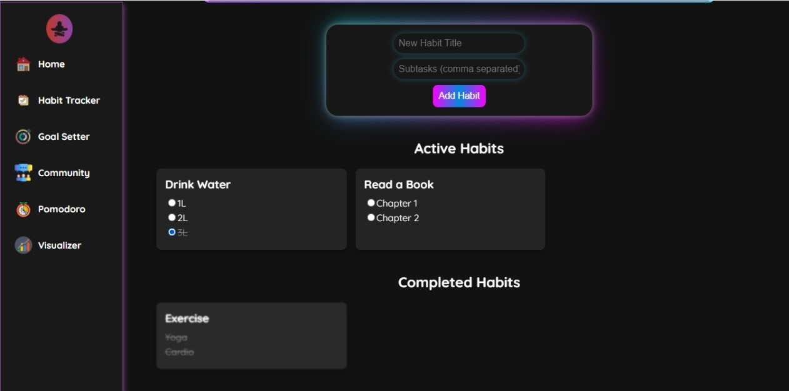

# Nexis - a productivity web-app

A productivity app built with React.js to help users stay organized and motivated.

## Features

### 1. Habit Tracker
Track and manage your daily habits to stay on top of your personal goals. Set habits, track progress, and get reminders to help you build lasting habits.

### 2. Goal Setter
Set and monitor your long-term and short-term goals. Break them down into actionable steps and check off progress as you go.

### 3. Pomodoro Timer
A simple, focused timer based on the Pomodoro Technique, which helps you work in intervals with short breaks in between. You can start, pause, or reset the timer and keep track of completed sessions.

### 4. Community Page
Connect with others who are on the same journey. Share your progress, ask for advice, and be part of a supportive community that motivates each other to achieve their goals.

### 5. Visualizer
An interactive visualizer to showcase your productivity, giving you a visual representation of your work habits, progress, and accomplishments.

## Conclusion
This productivity web app serves as a comprehensive tool for individuals looking to improve their daily habits, set and achieve goals, manage their time effectively using the Pomodoro technique, and connect with a supportive community. By integrating features like a habit tracker, goal setter, Pomodoro timer, and community page, the app promotes personal growth and collaboration. The user-friendly interface ensures accessibility, while the combination of modern technologies makes the app robust and efficient. Overall, this project embodies a practical solution for fostering productivity and building a positive, goal-oriented lifestyle.
